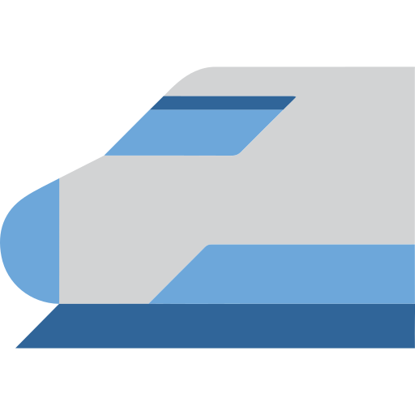

<div align="center">


<br/>


<br/>

<br/>

<a href="https://github.com/vigneshsivasubramaniyan">
  
</a>
&nbsp;
<a href="https://www.linkedin.com/in/vigneshwaran-sivasubramaniyan/">
  
</a>
&nbsp;
<a href="https://vignesh.madrasmic.in">
  
</a>

</div>

---

## About Me

Cloud & DevOps Engineer focused on **cloud infrastructure, automation, container platforms and AI-assisted operations**.

I work across **AWS, VMware, Docker, Kubernetes, OpenShift, Terraform, Ansible and CI/CD**, and build production-inspired systems through hands-on projects and homelab engineering.

My current direction is **Cloud-Native Platform Engineering + AI-powered DevOps**.

---

## Technology Stack
<table>
<tr>
<td width="30%" valign="top">
### Cloud & Infrastructure

<p>
  
</p>

`AWS` `Terraform` `Ansible` `Linux` `VMware` `vSphere`
</td>

<td width="30%" valign="top">
### Containers & Platform

<p>
  
</p>

`Docker` `Kubernetes` `OpenShift` `K3s` `Helm`
</td>

<td width="30%" valign="top">
### CI/CD & Observability

<p>
  
</p>

`Git` `GitHub` `Jenkins` `GitHub Actions` `Prometheus` `Grafana`
</td>

<td width="30%" valign="top">
### AI Engineering


  
  
  
  
  
  

`Python` `LangChain` `LangGraph` `LangFuse` `Qdrant` `Ollama` `LiteLLM` ``vLLM``
</td>

<td width="33%" valign="top">

</td>
</tr>
</table>

---

# Featured Projects

<table>
<tr>
<td width="33%" valign="top">

### 01
## Enterprise DevOps CI/CD

Automated application delivery from source control to container runtime and AWS infrastructure.

```text
GitHub
   ↓
Jenkins / Actions
   ↓
Docker
   ↓
Terraform
   ↓
AWS EC2
```

**Stack**

`GitHub` `Jenkins`  
`GitHub Actions` `Docker`  
`Terraform` `AWS`

</td>

<td width="33%" valign="top">

### 02
## DevOps Homelab

Self-hosted platform for DevOps, cloud-native infrastructure, observability and local AI workloads.

```text
Cloudflare
    ↓
Reverse Proxy
    ↓
Docker Platform
    ↓
DevOps + AI
    ↓
Monitoring
```

**Stack**

`Docker` `Cloudflare`  
`Jenkins` `Prometheus`  
`Grafana` `Ollama` `Qdrant`

</td>

<td width="33%" valign="top">

### 03
## AI DevOps Copilot

AI-assisted troubleshooting platform combining operational data, RAG and LLM reasoning.

```text
Jenkins
GitHub
Kubernetes
Prometheus
    ↓
   RAG
    ↓
  Qdrant
    ↓
   LLM
    ↓
RCA / Analysis
```

**Stack**

`Python` `LangChain`  
`LangGraph` `Qdrant`  
`Ollama` `Kubernetes`

</td>
</tr>
</table>

---

## Current Focus

<div align="center">

`AWS & Terraform`
&nbsp; → &nbsp;
`CI/CD Automation`
&nbsp; → &nbsp;
`Kubernetes & OpenShift`
&nbsp; → &nbsp;
`Observability`
&nbsp; → &nbsp;
`AI / RAG / Agents`
&nbsp; → &nbsp;
`AI-assisted DevOps`

</div>

---

## Let's Connect

<div align="center">

<a href="https://github.com/vigneshsivasubramaniyan">
  
</a>

<a href="https://www.linkedin.com/in/vigneshwaran-sivasubramaniyan/">
  
</a>

<a href="https://vignesh.madrasmic.in">
  
</a>

</div>

<br/>

<div align="center">

**Build · Automate · Observe · Improve**

</div>

---

<div align="center">


</div>
